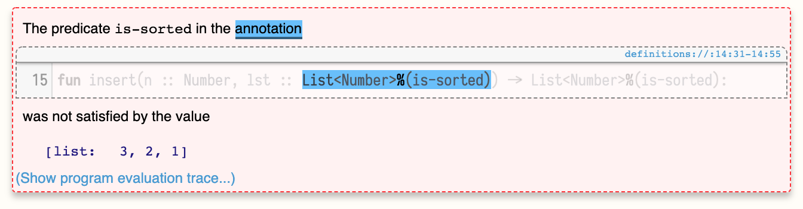

# Списки, сортировка, контракты
[Wed 9_12_18](https://brown.hosted.panopto.com/Panopto/Pages/Viewer.aspx?id=fb68ebe9-aaff-4398-a27a-a9590157d419)

Задача: отсортировать список чисел от меньшего к большему. Использовать только то, что знакомо, без методов стандартной библиотеки.

Примеры:

```pyret
check "sort list of numbers in ascending order":
    [list: ] is [list: ] # базовый случай
    [list: 3, 3, 3] is [list: 3, 3, 3] # убедится, что ничего не потеряем
    [list: 1, 2, 3] is [list: 1, 2, 3] # что ничего не сломаем
    # ...
end
```

## Шаблон
Мы работаем с рекурсивной структурой дынных «список чисел» (List of Numbers). Вот её определение:

```pyret
data LoN:
    | empty => ...
    | link(f, r) => ...
end
```

В языке уже есть `List<Number>`, но чтобы с ним работать, мы должны понимать, как он устроен внутри.

На основе структуры данных мы можем сформировать шаблон для работы с ней. Зачем нужен шаблон? Затем, что все функции для работы со структурой данных будут выглядеть похожим образом. Если мы составим общий паттерн для функции, которая обрабатывает структуру данных (все возможные кейсы), мы получим основу для любой задачи, которая использует эту структуру данных.

> Template is an attempt to extract as much code as we can out of the data definition even before we know what problem we're trying to solve.

Шаблон функции для работы со списком чисел:

```pyret
fun lon-fn(l :: List<Number>) -> ...:
    cases(List) l:
        | empty => ...
        | link(f, r) =>
            ...f...
            ...lon-fn(r)...
    end
end
```

Мы не знаем, что эта функция будет возвращать и как конкретно она будет обрабатывать возможные варианты списка чисел, поэтому ставим `...`, которые будут заполняться в процессе решения конкретной задачи.

В случае `empty` мы уже ничего не можем вытащить из определения данных (всё, пусто), поэтому сразу `...`. В случае `link(f, r)` есть ещё `f` и `r`.

`f` — уже конкретное значение, мы можем с ним работать, отображаем это как `...f...`. `r` — это такой же список чисел, как исходный `l` и для него шаблон может повториться заново (т.к. структура данных рекурсивная).

Прелесть составления шаблона в том, что мы получаем код без раздумий, просто анализируя определение типа данных, независимо от задачи, которую надо решить. И этот код частично или полностью может быть использован при составлении любой функции, которая работает со списком чисел.

Это работает везде: определение данных рулит процессом их обработки (центральная идея ООП).

> You drive the structure of the program from the structure of the data. This is the central idea of the object-oriented programming.

Эта идея по-разному реализована в ООП-языках и функциональных языках, но она одна.

Шаблон дает подсказку. Если задача — написать функцию, которая получает список чисел и тупо возвращает `3`, то вообще `cases` не нужны. Если задача — посчитать количество элементов, то во втором кейсе значение `f` не важно, вместо него будет всегда `1`. Но шаблон показывает нам то, что у нас есть в арсенале исходя из определения данных (inventory): вот из этих штук ты можешь составить решение, используй то, что нужно.

## Структурная рекурсия
Сортировка в `lon-sort.arr` — пример структурной рекурсии (structural recursion). Структурная рекурсия получается, когда само определение типа данных (списка) говорит, на чем надо запускать рекурсию (rest). Структурная рекурсия _гарантированно завершится_.

## Индуктивное программирование
Мы предполагаем, что функция `sort` сортирует список чисел по возрастанию и делаем следующий шаг. Мы предполагаем, что функция `insert` вставляет число в нужное место в отсортированном списке и делаем следующий шаг. Это как индукция в математике.

Структура данных (список) сконструирована из тех же составных частей, на которые мы её разбиваем в шаблоне. Мы программируем _индуктивно_, как в математике доказывают по индукции. Индуктивная структура данных — индуктивное программирование.

## Контракты с уточнёнными типами
В аннотации типов можно использовать предикаты, чтобы добавить ограничения для значений типа. Например, чтобы показать, что `List<Number>` должен быть отсортирован, нужно создать функцию-предикат `is-sorted` и добавить её в аннотацию типа через `%`:

```pyret
fun insert(n :: Number, lst :: List<Number>%(is-sorted)) -> List<Number>%(is-sorted):
    #...
end
```

Предикат будет запущен в рантайме на значении, проверит его на соответствие и покажет ошибку, если они не подходят:



Такие типы с прикреплёнными предикатами называются [refinement type](https://en.wikipedia.org/wiki/Refinement_type).

Тип данных `List` в языке далеко не всегда хорошо отображает предметную область задачи. Например, бессмысленно искать среднее арифметическое или максимальное значение в пустом списке. Правильный подход к такой задаче — решать её на уже ограниченном множестве. Так мы отсекаем все исключительные ситуации и может просто о них не думать.

Мы будем считать, что функции `average` и `max` могут быть объявлены _только для не пустых списков_. Для этого можно подготовить новый тип `NonEmptyList`, который может содержать либо одно значение, либо такой же `NonEmptyList`:

```pyret
data NEList:
    | one(n :: Number)
    | ne-link(first :: Number, rest :: NEList)
end

fun max(l :: NEList) -> Number:
    # ...
end
```

Либо использовать уточнённый тип:

```pyret
fun lon-max(l :: List<Number>%(is-non-empty)) -> Number:
    # ...
end

fun max(l :: List<Number>%(is-non-empty)) -> Number:
    # ...
end
```

