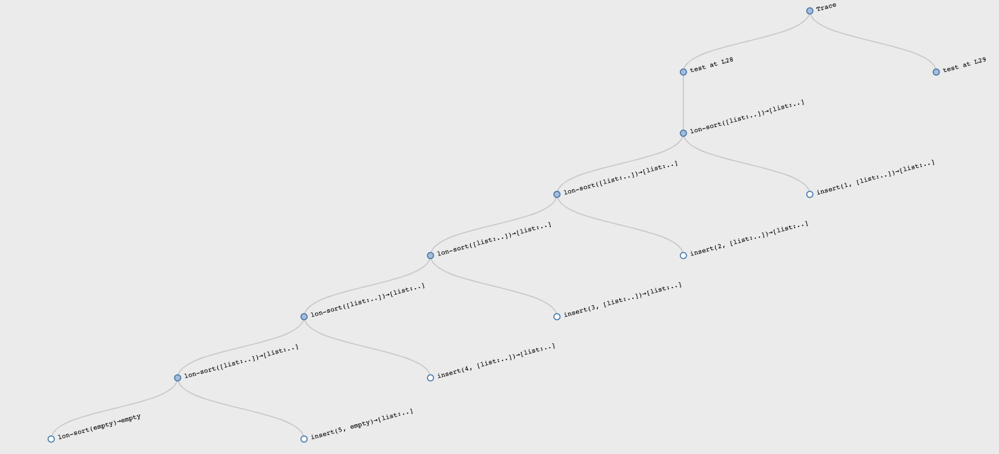
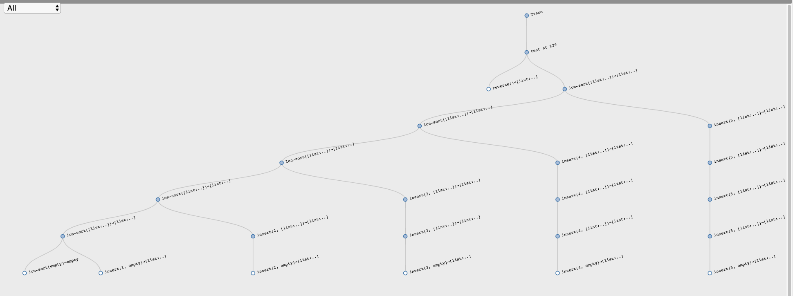

# Оптимизация, структурная и генеративная рекурсии 
Новый, экспериментальный редактор (может глючить): https://cpo.herokuapp.com/editor

В новом редакторе есть фичи: трейсинг и тайп-чекинг. Трейс показывает выполнение кода в виде графа и можно получить некоторые инсайты.

Например, так выглядит сортировка _уже_ отсортированного списка `sort([list: 1, 2, 3, 4, 5])`:

Каждый раз вызов `insert` происходит ровно 1 раз и чётко видно линейную (linear) зависимость.

А так выглядит худший случай — сортировка reversed-списка `sort([list: 5, 4, 3, 2, 1])`:

С каждой итерацией прибавляется новый элемент и каждая последующая вставка `insert` выполняется дольше. Это квадратичный алгоритм.

## Рецепты/шаблоны как прототипы решений
В HtDP рецепты нужны для того, чтобы получить _интуитивно подходящее для структура дынных рабочее_ решение. Но не алгоритмически оптимальное решение.

Зачем такое решение вообще может быть полезно? Затем, что мы максимально быстро можем проверить свою гипотезу. Когда задача сложная, то нам не стоит закапываться в оптимизацию до тех пор, пока мы не проверим свой алгоритм, свою гипотезу о верном решении. Но решив задачу максимально быстро и интуитивно и проверив её на тестовых данных мы можем спокойно оптимизировать решение уже зная, что оно рабочее.

[Test Oracle](https://en.wikipedia.org/wiki/Test_oracle). Проектируя сложную систему стоит сначала создать более простую, проверить её и на её основе продолжать разрабатывать сложную.

Пример: математик придумал формулу для каких-то ядерных вычислений. Она относительно небольшая. Программист превращает эту формулу в код, они с математиком проверяют корректность. Потом этот код дописывается так, чтобы он работал на большом вычислительном комплексе, кода становится во много раз больше, он учитывает массу разных штук (протоколы, параллельные вычисления и пр.) но тот, первый, простой вариант программы позволяет проверить итоговую реализацию на корректность.

## Оптимизация алгоритма сортировки
В 1959-м году Тони Хоар придумал [quicksort](https://en.wikipedia.org/wiki/Quicksort):

- Берём первый элемент списка `f` — pivot element (опорная точка);
- Разделяем оставшийся список на два: первый меньше `f`, второй больше `f`;
- Сортируем каждый список
- Объединяем оба списка в один с `f` посередине.

См. `lon-quicksort.arr`.

В решении задействовано несколько функций: `sort`, `all-lt`, `all-gte`, `combine`. Без тестов для каждой функции мы не сможем чётко изолировать проблему, если она возникнет. Чтобы показать это, Шрирам нарочно упустил `>=` в одной из вспомогательных функций. И ещё он в `all-gt` вызывал `all-lt`, вместо рекурсивного вызова `all-gt`. Проблема копипаста.

Есть категория проблем (багов), которые в принципе не могут произойти при использовании HtDP-рецептов.

Когда мы пишем алгоритм и замечаем, что написали сами то, что уже есть в языке, надо использовать то, что в языке. Потому что оно более оптимально. Например, `all-lt` и `all-gte` — это фильтры и лучше юзать `filter`.

Часто тем, кто пришёл из императивного стиля хочется добавить _флаг_ — дополнительный параметр в функцию, который будет говорить, надо ли делать сравнение через `<` или `>`. Это ок для школы, но в реальной жизни стоит помнить, что таких _опций может быть несколько_:

> If you have a procedure with 10 parameters, you probably missed some.
>
> — Alan Perlis

Выход — передавать функцию параметром, которая сама решит, что надо делать. Так мы получим reusable abstraction. **В 4-й домашке это есть.**

Примеры такой абстракции — `filter`, `map`, `fold`: мы сделали функции, которые отражают концепцию, а ты просто объясни, как именно этот концепт реализовать на твоей коллекции.

Нужно использовать структуру данных (список в случае сортировки) так, чтобы получалось максимально простое, наивное решение, которое не надо додумывать.

В случае с `all-lt` и `all-gte` мы генерируем новые проблемы. Какой длины получится список `all-lt(pivot, r)`? Если длина исходного списка равна `k`, то длина `r` равна `k - 1`, да? Или нет? А зависит от того, строгое или не строго неравенство используется. Часто `all-lt`/`all-gt` запускают не на `r`, а на исходном списке `l` (ну список же) и получают бесконечную рекурсию. Вот таких вопросов можно избежать.

Если взять задачу и решить её по рецепту через структурную рекурсию, то этих вопросов не будет. Нам не надо думать, завершится ли выполнение, правильно ли мы сравнили и т.д. Структурная рекурсия вытекает из самой структуры данных, с которой мы работаем. Оптимизируя мы уже используем generative recursion. Об этом есть [параграф в HtDP](https://htdp.org/2018-01-06/Book/part_five.html).

Структурная рекурсия не генерирует новых данных в процессе выполнения. Нам не надо думать о них вообще: правильный ли алгоритм генерации этих данных. Генеративная рекурсия, наоборот, генерирует их (новые списки с элементами больше/меньше `pivot`, сам `pivot`, итоговый список). И при генеративной рекурсии надо убеждаться в правильности решения каждой подпроблемы.

Quicksort плохо работает на уже сортированных списках. Мы получаем квадратичную зависимость. merge sort дает (n log n)
