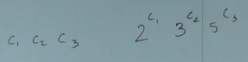

# Sets II
Видео: `09_Wed_9_26_18.ts`

На прошлом занятии разбирали 2 реализации сетов через списки с разной эффективностью функций `insert` и `size`:

- linear/linear
- constant/quadratic

Причём оба эти варианта типа Set реализованы через List и каждый под капотом имеет свою зависимость от этой реализации. Каждый вариант эффективен в зависимости от конкретной задачи. `linear/linear` больше подойдёт для повседневного использования на небольших множествах. `constant/quadratic` будет более полезной, когда нужно вставлять быстро, а узнавать размер очень-очень редко (например, логи писать).

Представление данных (data representation) может быть разным и лучше/хуже подходить для реализации конкретных задач. И даже нормально изменять это представление для разных типов обработки (разных вычислительных задач).

Например, каждый раз, когда мой лог превышает определённый размер, я буду выполнять чистку данных и перегонять её из raw data в реляционную модель из MongoDB в PostgreSQL. Этот размер (предел, порог, threshold) можно вычислить экспериментальным путём, вычислив допустимую эффективность. Например, 100 000 записей мне ок обработать квадратичным алгоритмом, а миллион уже нет. Поэтому буду дробить по сто тысяч.

Шрирам советует читать блоги. Там можно найти примеры применения алгоритмов из книжек в реальной разработке и вообще много чему научиться.

> Логарифмическая зависимость лучше линейной, она каждый раз разбивает проблему пополам + константа.

> Intuition: Logarithm of a number is essentially how many digits number has.

См. дополнительно про логарифм:

- https://www.quora.com/Is-there-a-trick-to-find-how-many-digits-a-certain-exponent-will-yield
- https://cnx.org/contents/ywnwlJeA@1.20:njDsQlIO@7/Essential-Mathematics 
- https://en.wikipedia.org/wiki/Logarithm
- https://www.reed.edu/academic_support/pdfs/qskills/logarithms.pdf

Если я умножу данные на 10, то мой логарифм увеличится на 1. На 100 — на 2. На миллион — на 6. Логарифмические алгоритмы очень эффективны.

Если пришло в миллиона раз больше посетителей, то достаточно оплатить 6 дополнительных серверов на Амазоне.

> Сет может быть более эффективным, чем log n.

Если хранить данные в отсортированном виде, то можно спокойно опускать часть данных. Например, если нужно вставить число в упорядоченное множество чисел. 

Если мы работаем не с числами, то нужно каким-то образом свести данные к числам.

## Gedel Numbering
> Как перевести строку в число?

Гёдель придумал решение: мы можем использовать простые числа как базу, а код букв как степень. Каждое число имеет одно произведение с простыми числами.



Здесь `c1`, `c2` и `c3` — числовое представление символов в строке.

Это сложно вычислять, но это отправная точка: такое решение может существовать. Каждый объект в памяти ЭВМ имеет свой адрес и это его числовое представление, на основе адреса также можно упорядочивать значения.

## Binary Trees
Все левые значения меньше, чем правые. Меньше в каком-то искусственном представлении, которое нам удобно. Если значение равное корню, то оно и есть корень:

[](https://mermaid-js.github.io/mermaid-live-editor/#/edit/eyJjb2RlIjoiZ3JhcGggVEI7XG4gICAgQSgoVnJvb3QpKS0tPkIoKFZsZWZ0KSlcbiAgICBBLS0-QygoVnJpZ2h0KSk7XG4gICAgQi0tPkUoKFZsZWZ0KSlcbiAgICBCLS0-RigoVnJpZ2h0KSlcbiAgICBDLS0-SCgoVmxlZnQpKVxuICAgIEMtLT5JKChWcmlnaHQpKVxuIiwibWVybWFpZCI6eyJ0aGVtZSI6ImRlZmF1bHQifSwidXBkYXRlRWRpdG9yIjpmYWxzZX0)

Data representation:

```pyret
data BinTree:
  | leaf
  | node(value :: Number, left :: BinTree, right :: BinTree)
end
```

Одна из проверок на состоятельность выбранной модели данных — можно ли с помощью этой структуры представить все возможные варианты? В данном случае деревья разных размеров: пустое, дерево с одним элементом, с сотней элементов...

Тип данных «бинарное дерево» никак не ограничивает то, что именно должно лежать в левом и правом потомке. Binary Search Tree уже ограничивает: левое значение должно быть меньше корня, правое — больше. Проверять можно через `%is-bst`, выполняя рекурсивный обход и убеждаясь, что все значения слева меньше, чем предыдущие корни и что значения справа больше. Дорогая операция, для тестов ок, для продакшена излишне.


